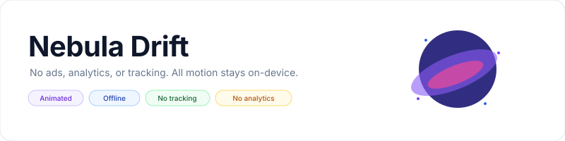
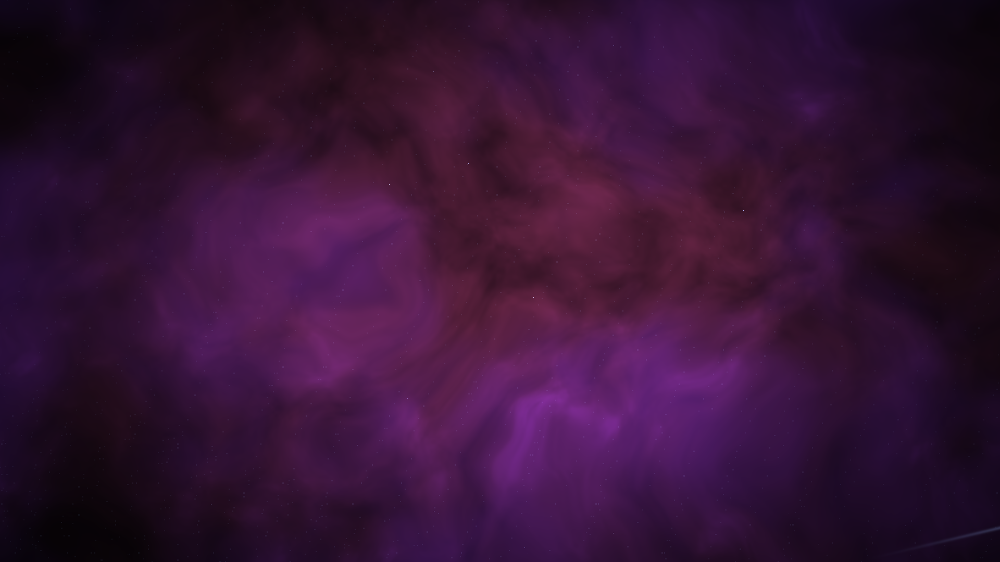
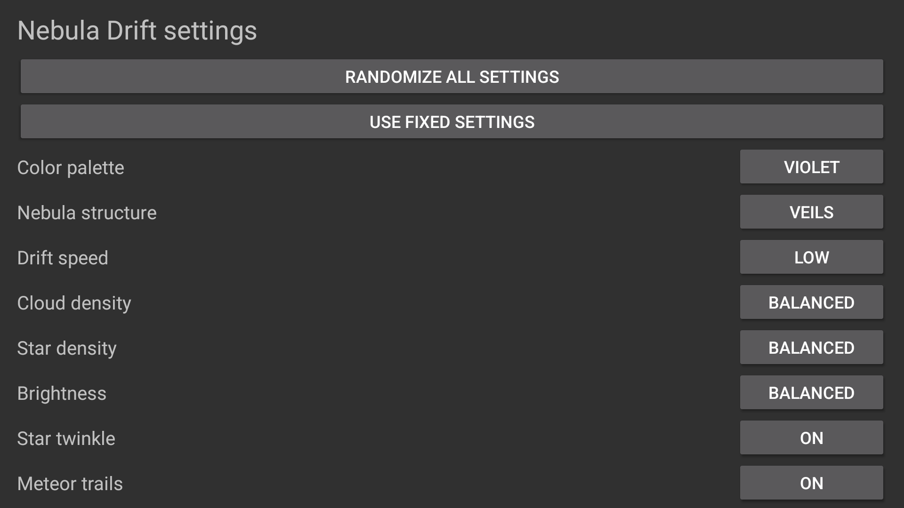

<p align="center">
    <picture>
        <source media="(prefers-color-scheme: dark)" srcset="art/banner-dark.svg">
        <source media="(prefers-color-scheme: light)" srcset="art/banner-light.svg">
        
    </picture>
</p>

<p align="center">An animated, offline nebula screensaver for Fire TV, Android TV, and Google TV.</p>

<p align="center">
    <a href="https://github.com/jeremykenedy/nebula-drift/releases"></a>
    <a href="https://github.com/jeremykenedy/nebula-drift/releases/latest"></a>
    <a href="https://github.com/jeremykenedy/nebula-drift/actions/workflows/tests.yml"></a>
    <a href="https://github.com/jeremykenedy/nebula-drift/actions/workflows/style.yml"></a>
    <a href="https://github.com/jeremykenedy/nebula-drift/actions/workflows/docs.yml"></a>
    <a href="https://github.com/jeremykenedy/nebula-drift/actions/workflows/security.yml"></a>
    <a href="https://www.codefactor.io/repository/github/jeremykenedy/nebula-drift"></a>
    <a href="LICENSE"></a>
</p>

<p align="center">
    <a href="https://github.com/jeremykenedy"></a>
    <a href="https://github.com/jeremykenedy/nebula-drift" title="Open the repository and click Star"></a>
    <a href="https://github.com/sponsors/jeremykenedy" title="Sponsor jeremykenedy"></a>
</p>

## Table of Contents

- [TV support](#tv-support)
- [Requirements](#requirements)
- [Installation](#installation)
- [Quick start](#quick-start)
- [Features](#features)
- [Configuration](#configuration)
- [Screenshots](#screenshots)
- [Documentation](#documentation)
- [Testing](#testing)
- [Privacy](#privacy)
- [License](#license)

## TV support

Nebula Drift is a single Android APK built for Android API 23 and newer. Its
DreamService renders an animated OpenGL ES 2.0 scene at the display surface
resolution. The application has been exercised on an Android TV API 31 emulator
at 1920 by 1080. No physical Fire TV, Android TV, or Google TV model has yet been
available for this project. The full verification matrix and a request for
device owners to report results are in [device verification](docs/VERIFICATION.md).

## Requirements

- Fire TV, Android TV, or Google TV on Android API 23 or newer with OpenGL ES 2.0.
- For installation by computer: Android Platform Tools, USB or network debugging,
  and ADB authorization on the TV.
- For local builds: JDK 21, Android SDK platform 36, build-tools 36.0.0, Python 3,
  `zip`, `openssl`, and `keytool`.

## Installation

Download `nebula-drift.apk` and its `.sha256` file from the
[latest release](https://github.com/jeremykenedy/nebula-drift/releases/latest).
Connect ADB and run the guided installer:

```bash
adb connect TV_IP:5555
python3 install.py --device TV_IP:5555
```

The installer verifies the APK checksum, explains the changes, asks for
confirmation, saves the TV's current screensaver selection, installs the APK,
and selects Nebula Drift. It leaves idle and sleep timeouts unchanged. Use
`--yes` only when you intend to accept those changes without an interactive
prompt. See [installation and restoration](docs/INSTALLATION.md) for update,
restore, and uninstall commands.

## Quick start

Open **Nebula Drift** from the TV app list to preview the animation and change
settings. To activate it as the idle screensaver, use the device's screensaver
selection settings or the guided installer. Remote controls work on the
settings screen: use Up and Down to move between choices, Select to cycle a
choice, and Back to leave the screen.

## Features

- Continuously animated gas clouds, luminous filaments, star fields, and meteor
  trails, rendered locally on the device.
- Four color palettes and four nebula structures.
- Independent random selection for every setting or one action to randomize all.
- Adjustable drift speed, cloud density, star density, brightness, twinkle, and
  meteor trails.
- No ads, analytics, tracking, crash reporting, runtime downloads, accounts, or
  network permission.
- An exported, documented settings provider for a compatible host application.

## Configuration

| Setting | Options | Default |
|---|---|---|
| Color palette | Violet, Blue, Emerald, Crimson, Random | Violet |
| Nebula structure | Veils, Pillars, Supernova, Dark matter, Random | Veils |
| Drift speed | Very low, Low, Balanced, High, Very high, Random | Low |
| Cloud density | Very low, Low, Balanced, High, Very high, Random | Balanced |
| Star density | Very low, Low, Balanced, High, Very high, Random | Balanced |
| Brightness | Very low, Low, Balanced, High, Very high, Random | Balanced |
| Star twinkle | Off, On, Random | On |
| Meteor trails | Off, On, Random | On |

Settings are saved on the TV. Random settings resolve once per showing and stay
steady until that showing ends. See [configuration details](docs/CONFIGURATION.md)
and the [settings-provider interface](docs/SETTINGS_PROVIDER.md).

## Screenshots

Screenshots are captured from the running app on the documented emulator after
the scene has animated for at least 40 seconds. They contain no interface text
or overlay.

<p align="center">
    
</p>

<p align="center">
    
</p>

## Documentation

- [Building](docs/BUILDING.md)
- [Installation, update, restore, and uninstall](docs/INSTALLATION.md)
- [Configuration](docs/CONFIGURATION.md)
- [Settings provider](docs/SETTINGS_PROVIDER.md)
- [Artwork and screenshot provenance](docs/ARTWORK.md)
- [Architecture](docs/ARCHITECTURE.md)
- [Device verification](docs/VERIFICATION.md)
- [Privacy](docs/PRIVACY.md)
- [CI](docs/CI.md)
- [Releasing](docs/RELEASING.md)
- [Troubleshooting](docs/TROUBLESHOOTING.md)

## Testing

Run `./test.sh` for installer safety and options behavior tests. Run
`./build.sh --unsigned` for a locally generated review APK, or `./build.sh` to
create the signed APK and checksum used for a release. Emulator and hardware
results are kept separately in the [verification matrix](docs/VERIFICATION.md).

## Privacy

Nebula Drift has no network permission and does not contact a server. The
settings provider is local to the installed device. The installer contacts only
the explicitly configured ADB device and does not send settings or usage data.
GitHub release downloads happen only when a user runs the installer or opens the
release page.

Show some love by starring this repository on GitHub.

## License

Nebula Drift is open source under the [Apache License, Version 2.0](LICENSE).
